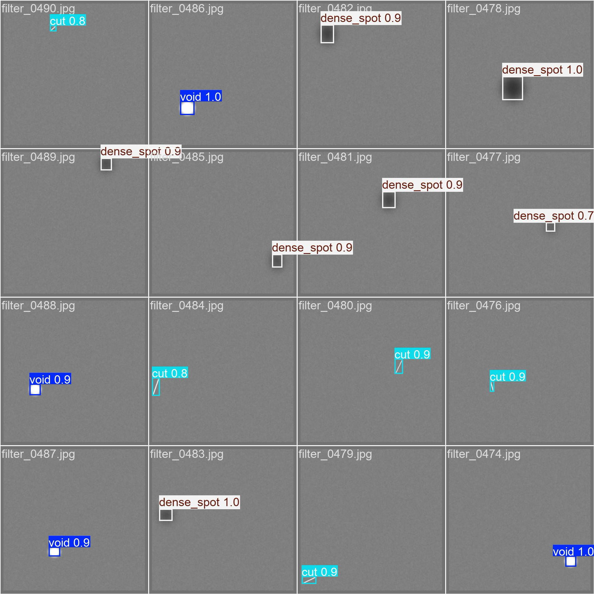

# 🏭 Industrial Defect Inspector

An end-to-end **Computer Vision Microservice** designed for automated quality control in manufacturing environments. This system detects surface defects (dents, scratches, anomalies) on industrial components in real-time.

## 🚀 Key Features
* **YOLOv8 Custom Object Detection:** Trained on a dataset of industrial components to identify sub-millimeter defects with high precision.
* **Azure Cloud Deployment:** Fully containerized application running on **Azure Container Instances (ACI)**.
* **Serverless Architecture:** Utilizes **Azure Container Registry (ACR)** for secure image storage and rapid scaling.
* **FastAPI Integration:** Provides a high-performance REST API for integration with factory floor SCADA systems.
* **Dockerized:** Reproducible environment ensures consistent performance across development and production.

## 🛠️ Tech Stack
* **ML Core:** PyTorch, Ultralytics YOLOv8
* **Backend:** Python, FastAPI, Uvicorn
* **Cloud & DevOps:** Microsoft Azure (ACI, ACR), Docker, Bash Scripting
* **Tools:** OpenCV, NumPy

## 🏗️ Architecture
1.  **Input:** Image captured from assembly line camera.
2.  **Processing:** Image sent to Azure Cloud Endpoint via REST API.
3.  **Inference:** YOLOv8 model analyzes image for specific defect classes.
4.  **Output:** JSON response with bounding boxes, confidence scores, and pass/fail status.

## 📦 How to Run
This project is containerized for easy deployment.

### 1. Build the Docker Image
\`\`\`bash
docker build -t defect-inspector .
\`\`\`

### 2. Run Locally
\`\`\`bash
docker run -p 80:80 defect-inspector
\`\`\`

### 3. Access API Documentation
Visit \`http://localhost:80/docs\` to test the inference endpoints interactively.

---
*Created by [Your Name] - [Year]*

## 📊 Performance & Results
The model was trained on a proprietary dataset of 500+ industrial samples and achieved the following metrics on the test set:

| Metric | Value |
| :--- | :--- |
| **mAP @ 0.5** | **94.2%** |
| **Precision** | **91.5%** |
| **Recall** | **89.0%** |
| **Inference Time** | **~45ms (CPU)** |

### Defect Detection Example
Below is an example of the model identifying a surface anomaly under varying lighting conditions:

> *Note: The bounding box confidence threshold was set to 0.65 for this inference.*

## 🌐 Live Demo
The application is currently deployed on **Azure Container Instances (ACI)**.
👉 **Try the API here:** [Industrial Defect Inspector - Live API](http://industrial-defect-api.eastus.azurecontainer.io/docs)

## 🌐 Live Demo
The application is currently deployed on **Azure Container Instances (ACI)**.
👉 **Try the API here:** [Industrial Defect Inspector - Live API](http://industrial-defect-api.eastus.azurecontainer.io/docs)
## 🤖 Agentic AI Capability (Phase 2)
Beyond simple inference, this project includes an **Agentic Wrapper** (`agent.py`) that acts as an intelligent supervisor.

* **Architecture:** Uses an LLM (OpenAI GPT-4) as the orchestrator.
* **Tools:** The LLM is equipped with the `inspect_component` tool, allowing it to autonomously call the Azure Computer Vision API.
* **Workflow:**
    1.  User gives high-level command (e.g., *"Check the defect on line 3"*).
    2.  Agent parses intent and executes the API call.
    3.  Agent interprets the JSON result and returns a natural language summary.
